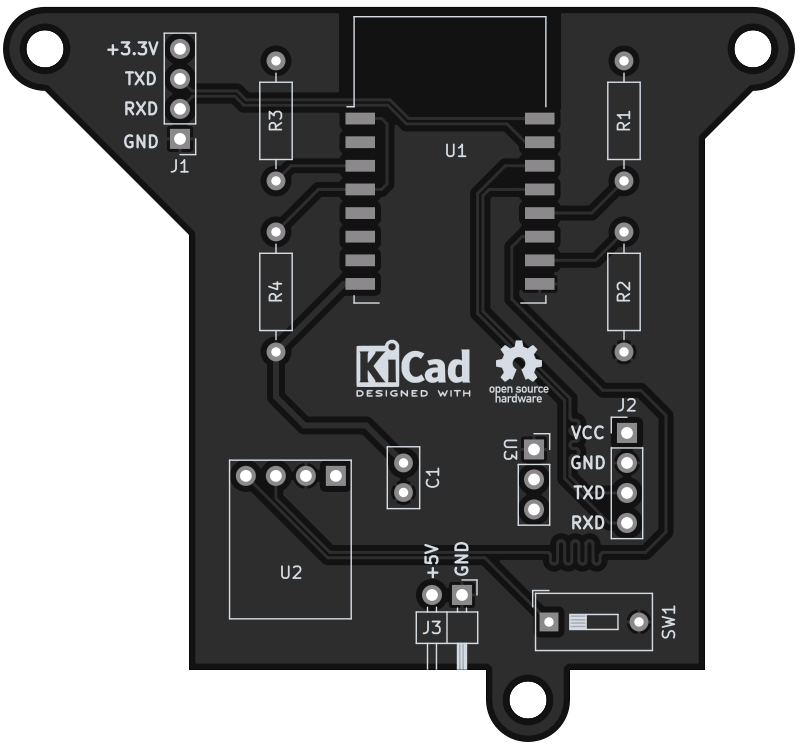
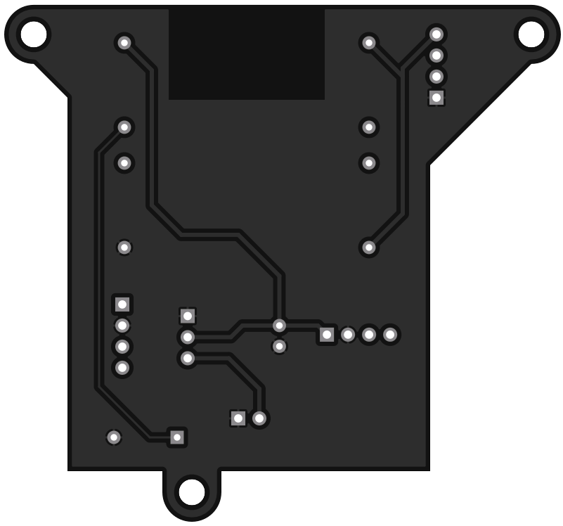

# Feinstaub

[![CC BY-SA 4.0][cc-by-sa-shield]][cc-by-sa]

## This project is completed and will not get updated anymore.

### ESP-12F powered piggyback PCB for the SDS011 fine dust sensor

The board is designed to run with the luftdaten.info firmware and has a place for a BME280 sensor.

Pic of the prototype (with enamel wire because it wouldn't be a prototype without it).

---

### BOM
 |Count|Part|Reference|Part URL|
 |-|-|-|-|
 |1|ESP12-F|U1|[ESP-12F](https://www.ebay.de/itm/255303527301)
 |1|Bosch BME-280 module|U2|[BME280](https://www.ebay.de/itm/255421634848)
 |1|Nova Fitness SDS-011 Module|---|[SDS-011](https://www.ebay.de/itm/255283289438)
 |1|AMS1117-3.3v step-down module|U3|[AMS1117-3.3 module](https://www.ebay.de/itm/174076431478)
 |1|DIP switch|SW1|[DIP-Switch](https://www.ebay.de/itm/255421634848)
 |1|100 nF ceramic disk capacitor|C1|[Kemet C315C104M5U5TA](https://octopart.com/c315c104m5u5ta-kemet-83288)
 |4|10 kΩ resistor|R1-R4|[Multicomp MF25 10k](https://octopart.com/mf25+10k-multicomp-2697429)

#### Assembly notes
The SDS011 module gets connected to the J2 pins on the main PCB.  
Remember that TX and RX have to be connected in reverse on the module.

The ESP chip can be flashed by connecting an ISP flasher to the J1 pins.  
To put the chip into flashing mode set the boot switch to on, plug in the power and then turn the switch back off.

DO NOT CONNECT BOTH THE MAIN POWER AND A FLASHER MODULE WITH POWER INPUT AT ONCE!!!  
If you use a flashing device that has power output on it's own the main power has to be left unconnected.

---

---

This work is licensed under a
[Creative Commons Attribution-ShareAlike 4.0 International License][cc-by-sa].

[![CC BY-SA 4.0][cc-by-sa-image]][cc-by-sa]

[cc-by-sa]: http://creativecommons.org/licenses/by-sa/4.0/
[cc-by-sa-image]: https://licensebuttons.net/l/by-sa/4.0/88x31.png
[cc-by-sa-shield]: https://img.shields.io/badge/License-CC%20BY--SA%204.0-lightgrey.svg
