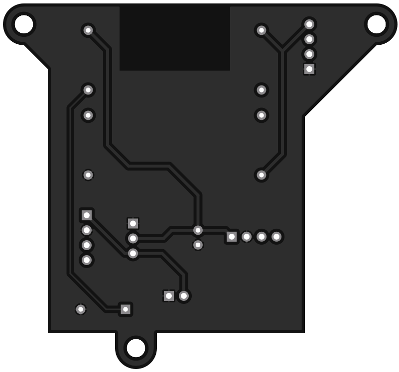

# Feinstaub

[![CC BY-SA 4.0][cc-by-sa-shield]][cc-by-sa]

## This project is completed and is not getting updated anymore.

### ESP-12F powered piggyback PCB for the SDS011 fine dust sensor

The board is designed to run with the luftdaten.info firmware and has a place for a BME280 sensor.

Pic of the prototype (with enamel wire because it wouldn't be a prototype without it).

---

---

This work is licensed under a
[Creative Commons Attribution-ShareAlike 4.0 International License][cc-by-sa].

[![CC BY-SA 4.0][cc-by-sa-image]][cc-by-sa]

[cc-by-sa]: http://creativecommons.org/licenses/by-sa/4.0/
[cc-by-sa-image]: https://licensebuttons.net/l/by-sa/4.0/88x31.png
[cc-by-sa-shield]: https://img.shields.io/badge/License-CC%20BY--SA%204.0-lightgrey.svg
